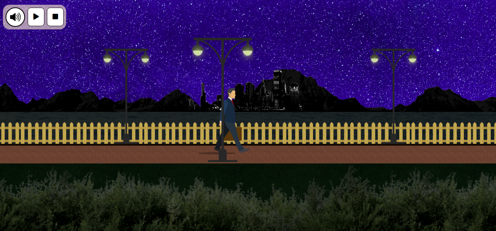
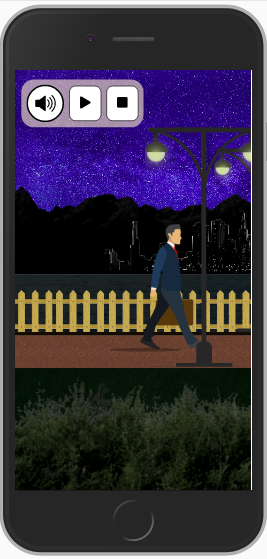

# <a href="https://jseguraweb.github.io/walking-guy/">The walking guy</a>

> CSS-Art Project: create the illusion of a character walking with pure CSS

> ## Details:

- It's about practicing. The intended user and the client is going to be me. 
- Goal: include it in my portfolio.
- Content required: 
    
    - All the background images, the icons
    - Find a free stock music song

> ## Priorities:

1. Start a Repository on GitHub
2. Create a Wireframe
3. Research. Topic: keyframes for the walking guy effect
4. Coding time

    **GOAL: create a responsive CSS-art project where the user can play and stop the music and the animation**

    

> ## New skills (to research):

- keyframes

> ## Achievements + lessons learned:

- get comfortable positioning elements.

> ## Ideas for the future:

- change background: day/night